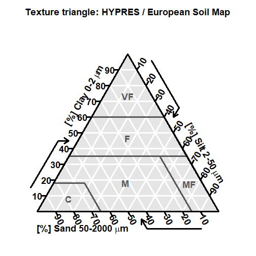

soiltexture: FAQ
================

_This page is under construction. Please come back later_

Test
----


```r
library( "soiltexture" ) 
```

```
## soiltexture 1.5.1 (git revision: 4b25ba2). For help type: help(pack='soiltexture')
```

```r
TT.plot()
```


